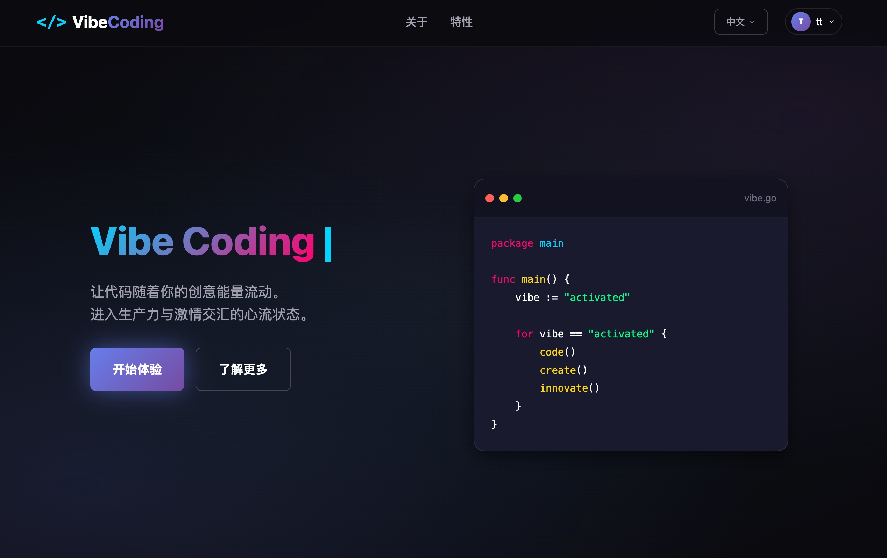
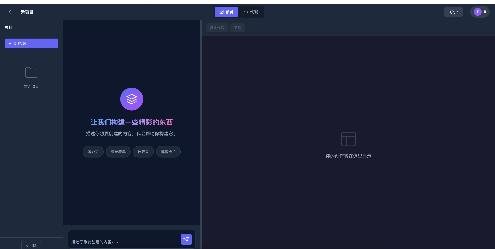
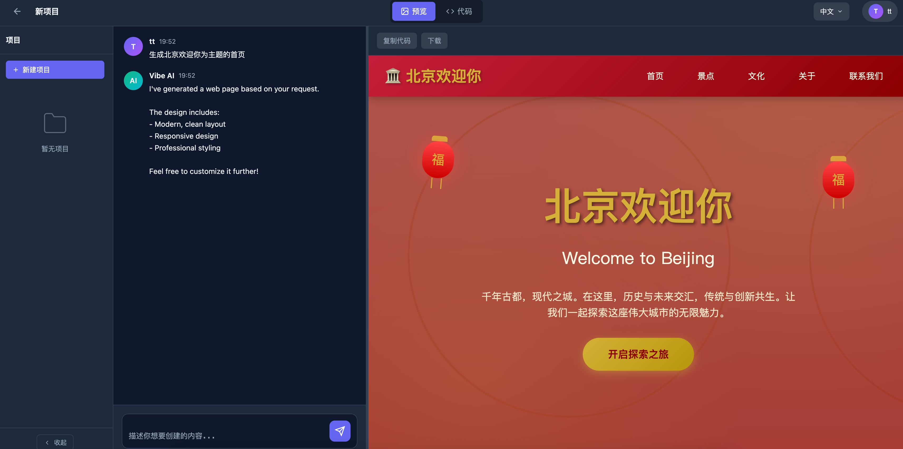

# Vibe Coding - AI 驱动的网页生成平台

基于 **Claude Agent SDK** 实现的 Vibe Coding 项目，通过自然语言描述即可生成现代化网页。

## 项目简介

**Vibe Coding** 是一种全新的编程方式——用自然语言描述你想要的内容，AI 会帮你生成代码。本项目集成了：

- **Claude Agent SDK** - Anthropic 官方的 AI Agent 开发工具包
- **Go + Hertz** - 高性能后端服务，处理用户认证和业务逻辑
- **Node.js Agent Server** - 基于 Claude Agent SDK 的代码生成服务
- **现代化前端** - 深色科技感 UI，实时预览生成结果

### 核心功能

| 功能 | 描述 |
|------|------|
| AI 网页生成 | 输入自然语言描述，自动生成 HTML/CSS 代码 |
| 实时预览 | 生成过程中实时展示代码，完成后立即预览效果 |
| 流式输出 | SSE 实时流式传输生成内容 |
| 用户认证 | JWT 认证保护 API 访问 |
| 模板库 | 内置 Landing Page、Dashboard、Login 等模板 |

## 页面展示

### 首页 (index.html)

首页采用深色科技感设计，展示 Vibe Coding 品牌形象。



**主要功能：**
- 动态打字机效果的 Hero 区域
- 粒子背景动画
- 用户注册/登录系统
- 多语言切换（中/英文）
- 响应式导航栏
- 特性介绍展示
- API 状态实时监控

访问地址：`http://localhost:8888/`

---

### AI 工作台 (workspace.html)

工作台是 Vibe Coding 的核心功能页面，提供 AI 驱动的网页生成体验。



**主要功能：**
- **Prompt 输入区** - 输入自然语言描述，如 "创建一个现代化的 SaaS 登录页"
- **实时代码流** - 流式展示 AI 生成的代码过程
- **HTML/CSS 分离** - 分标签页查看生成的 HTML 和 CSS
- **实时预览** - 生成完成后立即预览效果
- **一键复制** - 快速复制生成的代码
- **代码编辑器风格** - 语法高亮、行号显示

访问地址：`http://localhost:8888/workspace.html`

---

### AI 生成预览

下图展示 AI 根据 Prompt 生成的网页效果：



**支持的页面类型：**
- SaaS Landing Page（落地页）
- Dashboard（仪表盘）
- Login/Register Form（登录/注册表单）
- Blog Card（博客卡片）
- 以及更多自定义页面...

## 环境要求

| 依赖 | 版本 | 说明 |
|------|------|------|
| Go | >= 1.22 | 后端服务 |
| Node.js | >= 18.0 | Agent Server |
| MySQL | >= 8.0 | 主数据库 |
| Redis | >= 7.0 | 缓存数据库 |
| Docker | >= 20.0 | 容器化部署（可选）|
| ANTHROPIC_API_KEY | - | Claude API 密钥 |

## 性能基准

> 测试环境：Apple M4 Pro / 16GB / macOS
> 测试工具：wrk / go test -bench

| 接口 | QPS | 平均延迟 | P99 延迟 | 说明 |
|------|-----|---------|---------|------|
| GET /ping | ~65,000 | 0.15ms | 1.2ms | 健康检查 |
| GET /api/v1/users | ~44,000 | 0.23ms | 1.8ms | 分页查询（L1缓存命中）|
| GET /api/v1/users/:id | ~38,000 | 0.26ms | 2.1ms | 单条查询（L1缓存命中）|
| POST /api/v1/users | ~12,000 | 0.83ms | 3.5ms | 创建用户（含DB写入）|

### 性能优化亮点

- **三级缓存架构**: L1 LocalCache (64MB) → L2 Redis → L3 MySQL
- **连接池优化**: MySQL/Redis 连接池动态调优
- **零拷贝**: unsafe 字符串转换，减少内存分配
- **对象池复用**: sync.Pool 减少 GC 压力
- **Singleflight**: 防止缓存击穿

## 技术栈

### AI 层

| 组件 | 技术选型 | 说明 |
|------|---------|------|
| AI SDK | [@anthropic-ai/claude-agent-sdk](https://www.npmjs.com/package/@anthropic-ai/claude-agent-sdk) | Anthropic 官方 Agent SDK |
| Agent Server | [Express.js](https://expressjs.com/) | Node.js Web 框架 |

### Go 后端

| 组件 | 技术选型 | 说明 |
|------|---------|------|
| Web 框架 | [Hertz](https://github.com/cloudwego/hertz) | 字节跳动高性能 HTTP 框架 |
| 日志 | [Zap](https://github.com/uber-go/zap) | Uber 高性能日志库 |
| ORM | [GORM](https://gorm.io/) | Go 语言 ORM 框架 |
| 缓存 | [go-redis](https://github.com/redis/go-redis) + [Ristretto](https://github.com/dgraph-io/ristretto) | 分布式 + 本地缓存 |
| 配置 | [Viper](https://github.com/spf13/viper) | 配置管理（YAML + 环境变量）|
| JSON | [Sonic](https://github.com/bytedance/sonic) | 字节跳动高性能 JSON 库 |
| 认证 | [JWT](https://github.com/golang-jwt/jwt) | JSON Web Token |
| 监控 | [Prometheus](https://prometheus.io/) | 指标监控 |
| 追踪 | [OpenTelemetry](https://opentelemetry.io/) | 分布式链路追踪 |
| 校验 | [Validator](https://github.com/go-playground/validator) | 参数校验 |
| 文档 | [Swaggo](https://github.com/swaggo/swag) | Swagger API 文档 |
| 熔断 | [GoBreaker](https://github.com/sony/gobreaker) | 熔断器模式 |

## 项目特性

### 核心功能

| 功能 | 描述 |
|------|------|
| 用户认证 | 注册、登录、登出、修改密码、注销账号 |
| 参数校验 | 基于 validator 的请求参数校验 |
| 分页查询 | 统一分页参数解析和结果格式 |
| 限流保护 | IP 级 + 全局 + 分布式限流 |
| JWT 认证 | Bearer Token 认证中间件 |
| Token 黑名单 | 登出后 Token 失效（Redis 存储）|
| 链路追踪 | LogID 贯穿请求全生命周期 |
| 指标监控 | Prometheus 指标采集 |
| 性能分析 | pprof 端点集成 |
| API 文档 | Swagger UI 自动生成 |
| 熔断降级 | 路径级别熔断保护 |
| 国际化 | 多语言支持 (i18n) |

### 中间件（12个）

| 中间件 | 功能 |
|--------|------|
| Recovery | 捕获 panic，防止服务崩溃 |
| RequestID | 为每个请求生成唯一 ID |
| AccessLog | 记录请求日志（自动携带 logid）|
| CORS | 跨域支持 |
| RateLimit | 请求限流（IP级 + 全局）|
| JWTAuth | JWT 认证 |
| Metrics | Prometheus 指标采集 |
| Gzip | 响应压缩 |
| Timeout | 请求超时控制 |
| Tracing | OpenTelemetry 链路追踪 |
| CircuitBreaker | 熔断器 |
| I18n | 国际化 |

### 缓存系统（三级架构）

```
请求 → L1 LocalCache (64MB, ~50μs)
         ↓ miss
       L2 Redis (~1ms)
         ↓ miss
       L3 MySQL (~5ms)
         ↓
       回填 L2 + L1
```

**防护机制**:
- 缓存穿透：布隆过滤器 + 空值缓存
- 缓存击穿：Singleflight 合并请求
- 缓存雪崩：TTL 随机化

### 日志系统

- 控制台彩色输出 + JSON 文件日志
- 自动轮转（按大小 100MB / 保留 30 天）
- logid 链路追踪
- 简化 API：`logger.InfoCtxf(ctx, "msg", "key", value)`

### Claude Agent SDK 集成

项目使用 **@anthropic-ai/claude-agent-sdk** 实现 AI 代码生成：

```javascript
import { query } from '@anthropic-ai/claude-agent-sdk';

// 使用 Agent SDK 生成网页
for await (const message of query({
    prompt: "Create a modern landing page",
    options: {
        allowedTools: ['Read', 'Write', 'Edit'],
        maxTurns: 5,
    }
})) {
    // 流式处理生成内容
}
```

**Agent Server 特性**：
- 基于 Express.js 构建
- JWT 认证保护
- SSE 流式输出
- 智能模板回退机制

### 前端工作台 (Vibe Coding Workspace)

项目内置了一个现代化的 AI 编程工作台：

- **技术栈**：纯 HTML/CSS/JavaScript，无框架依赖
- **设计风格**：深色科技感、渐变色、霓虹发光效果
- **功能模块**：
  - AI 网页生成器 - 输入描述即可生成代码
  - 实时代码预览 - 流式展示生成过程
  - HTML/CSS 分离展示
  - 一键复制代码
  - 用户认证系统

访问工作台：`http://localhost:8888/workspace.html`
访问首页：`http://localhost:8888/`

## 项目结构

```
.
├── agent-server/               # 🤖 Claude Agent SDK 服务
│   ├── server.js               # Agent Server 主程序
│   ├── package.json            # Node.js 依赖
│   └── node_modules/           # 依赖包
├── cmd/                        # Go 应用入口
│   └── api/
│       └── main.go
├── config/                     # 配置
│   ├── config.go               # 配置定义
│   ├── config.yaml             # 默认配置
│   ├── config.dev.yaml         # 开发环境
│   └── config.prod.yaml        # 生产环境
├── internal/                   # 内部代码
│   ├── dao/                    # 数据访问层
│   ├── handler/                # 请求处理器
│   ├── middleware/             # 中间件（12个）
│   ├── model/                  # 数据模型
│   ├── router/                 # 路由
│   └── service/                # 业务逻辑
├── pkg/                        # 公共包
│   ├── breaker/                # 熔断器
│   ├── cache/                  # 缓存系统（Redis + Local + 保护机制）
│   ├── database/               # MySQL 封装
│   ├── errcode/                # 错误码定义
│   ├── i18n/                   # 国际化
│   ├── jwt/                    # JWT 工具
│   ├── logger/                 # 日志封装
│   ├── pagination/             # 分页工具
│   ├── response/               # 统一响应
│   ├── tracing/                # 链路追踪
│   └── validate/               # 参数校验
├── web/                        # 前端页面 (Vibe Coding)
│   ├── index.html              # 首页
│   ├── workspace.html          # AI 工作台
│   ├── static/css/             # 样式文件
│   ├── static/js/              # JavaScript 模块
│   └── assets/                 # 静态资源
├── docs/                       # Swagger 文档
├── locales/                    # 多语言文件
├── scripts/                    # SQL 初始化脚本
├── .github/workflows/          # CI/CD 配置
├── .air.toml                   # Air 热重载配置
├── .golangci.yml               # 代码检查配置
├── Dockerfile
├── docker-compose.yaml
└── Makefile
```

## 快速开始

### 环境准备

```bash
# 1. 克隆项目
git clone https://github.com/test-tt/test-tt.git
cd test-tt

# 2. 安装 Go 依赖
make tidy

# 3. 安装 Agent Server 依赖
cd agent-server && npm install && cd ..

# 4. 配置 API 密钥
export ANTHROPIC_API_KEY="your-api-key"

# 5. 初始化数据库（首次运行）
mysql -u root -p < scripts/init.sql
```

### 本地开发

需要同时启动两个服务：

**终端 1 - 启动 Go 后端：**
```bash
# 热重载开发（推荐）
make dev

# 或使用配置文件运行
make run-dev     # 开发环境
make run-prod    # 生产环境
```

**终端 2 - 启动 Agent Server：**
```bash
# 使用 Makefile（推荐，自动配置 JWT）
make agent       # 生产模式
make agent-dev   # 开发模式（自动重载）

# 或手动启动
cd agent-server
npm start        # 生产模式
npm run dev      # 开发模式（自动重载）
```

Agent Server 默认运行在 `http://localhost:3001`

> **注意**：Agent Server 需要与 Go 后端共享 JWT 密钥才能验证用户身份。使用 `make agent` 会自动配置。

### Docker 部署

```bash
# 构建并启动（MySQL + Redis + API）
make docker-up

# 查看日志
make docker-logs

# 停止
make docker-down
```

### 常用命令

```bash
# 开发
make dev          # 热重载开发（Go 后端）
make run          # 直接运行
make run-dev      # 开发环境运行
make run-prod     # 生产环境运行

# Agent Server
make agent-install # 安装 Agent Server 依赖
make agent        # 启动 Agent Server（生产模式）
make agent-dev    # 启动 Agent Server（开发模式）

# 构建
make build        # 编译二进制
make swagger      # 生成 Swagger 文档

# 测试
make test         # 运行测试
make test-cover   # 测试覆盖率

# 代码质量
make lint         # 代码检查 (golangci-lint)
make fmt          # 格式化代码

# Docker
make docker-up    # 启动服务 (MySQL + Redis + API)
make docker-down  # 停止服务
make docker-logs  # 查看日志

# 帮助
make help         # 查看所有命令
```

### 编译命令

```bash
# 标准编译
make build
# 或
go build -o build/test-tt ./cmd/api

# 生产环境编译（优化体积，去除调试信息）
CGO_ENABLED=0 go build -ldflags="-w -s" -o build/test-tt ./cmd/api

# 交叉编译
CGO_ENABLED=0 GOOS=linux GOARCH=amd64 go build -o build/test-tt-linux-amd64 ./cmd/api
CGO_ENABLED=0 GOOS=linux GOARCH=arm64 go build -o build/test-tt-linux-arm64 ./cmd/api
CGO_ENABLED=0 GOOS=darwin GOARCH=amd64 go build -o build/test-tt-darwin-amd64 ./cmd/api
CGO_ENABLED=0 GOOS=darwin GOARCH=arm64 go build -o build/test-tt-darwin-arm64 ./cmd/api

# 编译并运行
make build && ./build/test-tt
```

### 停止服务

```bash
# Docker 方式
make docker-down

# 停止 Go 后端
pkill -f test-tt
# 或
kill $(lsof -t -i:8888)

# 停止 Agent Server
pkill -f "node.*server.js"
# 或
kill $(lsof -t -i:3001)

# 一键停止所有服务（Go 后端 + Agent Server）
pkill -f test-tt; pkill -f "node.*server.js"
# 或
kill $(lsof -t -i:8888) 2>/dev/null; kill $(lsof -t -i:3001) 2>/dev/null
```

## API 接口

### Swagger 文档

启动服务后访问：
```
http://localhost:8888/swagger/index.html
```

### Agent Server API (端口 3001)

AI 代码生成服务，基于 Claude Agent SDK：

| 方法 | 路径 | 描述 | 认证 |
|------|------|------|------|
| POST | `/api/generate` | 创建生成任务 | JWT |
| GET | `/api/session/:id` | 获取会话状态 | JWT |
| GET | `/api/stream/:id` | SSE 流式输出 | JWT |
| GET | `/api/sessions` | 列出所有会话 | JWT |
| GET | `/health` | 健康检查 | 否 |

**生成示例：**
```bash
curl -X POST http://localhost:3001/api/generate \
  -H "Authorization: Bearer <token>" \
  -H "Content-Type: application/json" \
  -d '{"prompt": "Create a modern SaaS landing page"}'
```

### Go 后端基础接口 (端口 8888)

| 方法 | 路径 | 描述 |
|------|------|------|
| GET | `/ping` | 健康检查 |
| GET | `/metrics` | Prometheus 指标 |
| GET | `/swagger/*any` | Swagger API 文档 |

### 性能分析 (pprof)

| 方法 | 路径 | 描述 |
|------|------|------|
| GET | `/debug/pprof/` | pprof 索引页 |
| GET | `/debug/pprof/heap` | 堆内存分析 |
| GET | `/debug/pprof/goroutine` | Goroutine 分析 |
| GET | `/debug/pprof/profile` | CPU 分析 (30s) |
| GET | `/debug/pprof/trace` | 执行追踪 |

### 认证接口

| 方法 | 路径 | 描述 | 认证 |
|------|------|------|------|
| POST | `/api/v1/auth/register` | 用户注册 | 否 |
| POST | `/api/v1/auth/login` | 用户登录 | 否 |
| POST | `/api/v1/auth/logout` | 用户登出 | JWT |
| GET | `/api/v1/auth/profile` | 获取当前用户信息 | JWT |
| PUT | `/api/v1/auth/profile` | 修改当前用户信息 | JWT |
| PUT | `/api/v1/auth/password` | 修改密码 | JWT |
| DELETE | `/api/v1/auth/account` | 注销账号 | JWT |

### 用户管理接口

| 方法 | 路径 | 描述 | 认证 |
|------|------|------|------|
| GET | `/api/v1/users` | 获取用户列表（分页）| 否 |
| GET | `/api/v1/users/:id` | 获取用户详情 | 否 |
| POST | `/api/v1/users` | 创建用户 | JWT |
| PUT | `/api/v1/users/:id` | 更新用户 | JWT |
| DELETE | `/api/v1/users/:id` | 删除用户 | JWT |

### 分页参数

```
GET /api/v1/users?page=1&page_size=10
```

响应格式：
```json
{
  "code": 0,
  "message": "success",
  "data": {
    "list": [...],
    "total": 100,
    "page": 1,
    "page_size": 10,
    "pages": 10
  }
}
```

### JWT 认证

需要在请求头添加：
```
Authorization: Bearer <token>
```

### 认证接口示例

**注册**：
```bash
curl -X POST http://localhost:8888/api/v1/auth/register \
  -H "Content-Type: application/json" \
  -d '{"name": "张三", "email": "zhangsan@example.com", "password": "password123"}'
```

响应：
```json
{
  "code": 0,
  "message": "success",
  "data": {
    "user": {
      "id": 1,
      "name": "张三",
      "email": "zhangsan@example.com",
      "age": 0,
      "created_at": "2025-01-01T00:00:00Z",
      "updated_at": "2025-01-01T00:00:00Z"
    },
    "token": "eyJhbGciOiJIUzI1NiIsInR5cCI6IkpXVCJ9..."
  }
}
```

**登录**：
```bash
curl -X POST http://localhost:8888/api/v1/auth/login \
  -H "Content-Type: application/json" \
  -d '{"email": "zhangsan@example.com", "password": "password123"}'
```

**登出**：
```bash
curl -X POST http://localhost:8888/api/v1/auth/logout \
  -H "Authorization: Bearer <token>"
```

**获取用户信息**：
```bash
curl http://localhost:8888/api/v1/auth/profile \
  -H "Authorization: Bearer <token>"
```

**修改用户信息**：
```bash
curl -X PUT http://localhost:8888/api/v1/auth/profile \
  -H "Authorization: Bearer <token>" \
  -H "Content-Type: application/json" \
  -d '{"name": "李四", "age": 30}'
```

**修改密码**：
```bash
curl -X PUT http://localhost:8888/api/v1/auth/password \
  -H "Authorization: Bearer <token>" \
  -H "Content-Type: application/json" \
  -d '{"old_password": "password123", "new_password": "newpassword456"}'
```

**注销账号**：
```bash
curl -X DELETE http://localhost:8888/api/v1/auth/account \
  -H "Authorization: Bearer <token>" \
  -H "Content-Type: application/json" \
  -d '{"password": "password123"}'
```

## 配置说明

### 多环境配置

```bash
config/
├── config.yaml       # 默认配置
├── config.dev.yaml   # 开发环境
└── config.prod.yaml  # 生产环境
```

### 环境变量

支持通过环境变量覆盖配置，前缀为 `APP_`：

```bash
APP_SERVER_PORT=9000
APP_MYSQL_HOST=mysql.example.com
APP_REDIS_HOST=redis.example.com
APP_JWT_SECRET=your-secret-key
```

**Agent Server 环境变量**：

Agent Server 需要与 Go 后端共享 JWT 配置：

```bash
# JWT 密钥（必须与 Go 后端一致）
export JWT_SECRET="your-secret-key-at-least-32-chars"
export JWT_ISSUER="test-tt"

# Claude API 密钥
export ANTHROPIC_API_KEY="your-api-key"
```

> **重要**：使用 `make agent` 或 `make agent-dev` 会自动从 Makefile 中读取默认的 JWT 配置。生产环境请务必修改为安全的密钥。

### 配置示例

```yaml
env: dev

server:
  host: 0.0.0.0
  port: 8888
  read_timeout: 10s
  write_timeout: 10s

mysql:
  host: 127.0.0.1
  port: 3306
  username: root
  password: ""
  database: test
  max_open_conns: 100
  max_idle_conns: 10

redis:
  host: 127.0.0.1
  port: 6379
  pool_size: 100

log:
  level: info
  filename: logs/app.log

jwt:
  secret: your-secret-key
  expire_time: 24h

ratelimit:
  rate: 100
  burst: 200
```

## 开发规范

### 分层架构

```
Handler -> Service -> DAO -> Model
    ↓         ↓        ↓
 请求处理   业务逻辑   数据访问
```

### 添加新接口

1. `internal/model/` - 定义数据模型
2. `internal/dao/` - 实现数据访问
3. `internal/service/` - 实现业务逻辑
4. `internal/handler/` - 实现请求处理（添加 Swagger 注解）
5. `internal/router/` - 注册路由
6. 运行 `make swagger` 更新文档

### 日志使用

```go
import "github.com/test-tt/pkg/logger"

// 带 context（推荐，自动携带 logid）
logger.InfoCtxf(ctx, "user created", "id", user.ID, "name", user.Name)

// 不带 context
logger.Infof("server started", "port", 8888)
```

### 参数校验

```go
type CreateUserRequest struct {
    Name  string `json:"name" validate:"required,min=2,max=50"`
    Age   int    `json:"age" validate:"gte=0,lte=150"`
    Email string `json:"email" validate:"omitempty,email"`
}
```

### 错误码

```go
response.Fail(c, errcode.ErrUserNotFound)
response.Fail(c, errcode.ErrInvalidParams.WithMessage("name is required"))
```

**错误码规范**：

| 范围 | 类型 | 示例 |
|------|------|------|
| 0 | 成功 | 0 = Success |
| 1xxx | 通用错误 | 1001 = 参数错误, 1002 = 未授权 |
| 2xxx | 用户错误 | 2001 = 用户不存在, 2004 = 密码错误, 2005 = 邮箱已使用 |
| 3xxx | 数据库错误 | 3001 = 数据库错误 |
| 4xxx | 缓存错误 | 4001 = 缓存错误 |

**用户相关错误码详情**：

| 错误码 | 说明 |
|--------|------|
| 2001 | 用户不存在 |
| 2002 | 用户已存在 |
| 2003 | 无效的用户ID |
| 2004 | 密码错误 |
| 2005 | 邮箱已被使用 |
| 2006 | Token 无效 |
| 2007 | Token 已过期 |
| 2008 | 需要登录 |
| 2009 | 密码强度不足 |

## 监控

### Prometheus 指标

访问 `/metrics` 获取指标数据：

- `http_requests_total` - HTTP 请求总数（按路径、方法、状态码）
- `http_request_duration_seconds` - HTTP 请求延迟分布
- `http_requests_in_flight` - 当前处理中的请求数

### pprof 性能分析

```bash
# 浏览器访问
open http://localhost:8888/debug/pprof/

# 命令行分析
go tool pprof http://localhost:8888/debug/pprof/heap
go tool pprof http://localhost:8888/debug/pprof/profile?seconds=30
```

### Grafana 看板

推荐监控指标：
- QPS 和错误率
- 请求延迟 (P50/P90/P99)
- 在途请求数
- Goroutine 数量
- 内存使用

## CI/CD

项目已集成 GitHub Actions，包含：

- **Lint**: golangci-lint 代码检查
- **Test**: 单元测试（含 MySQL/Redis 服务）
- **Build**: 多平台编译 (linux/darwin, amd64/arm64)
- **Docker**: 镜像构建（main 分支触发）

## 常见问题

### 端口被占用

**Go 后端（端口 8888）：**
```bash
# 查看占用端口的进程
lsof -i:8888

# 杀死进程
kill -9 <PID>

# 或者直接一条命令
kill -9 $(lsof -t -i:8888)
```

**Agent Server（端口 3001）：**
```bash
# 查看占用端口的进程
lsof -i:3001

# 杀死进程
kill -9 <PID>

# 或者直接一条命令
kill -9 $(lsof -t -i:3001)
```

**同时释放两个端口：**
```bash
kill -9 $(lsof -t -i:8888) 2>/dev/null; kill -9 $(lsof -t -i:3001) 2>/dev/null
```

### 数据库连接失败

1. 检查 MySQL 是否启动：`mysql.server status`
2. 检查配置文件中的数据库连接信息
3. 确认数据库和用户权限已创建

### Redis 连接失败

1. 检查 Redis 是否启动：`redis-cli ping`
2. 检查配置文件中的 Redis 连接信息

### Swagger 页面打不开

1. 确认已生成文档：`make swagger`
2. 检查 `docs/` 目录是否存在 `swagger.json`

### 热重载不生效

1. 确认已安装 Air：`go install github.com/air-verse/air@latest`
2. 检查 `.air.toml` 配置文件

## License

MIT
